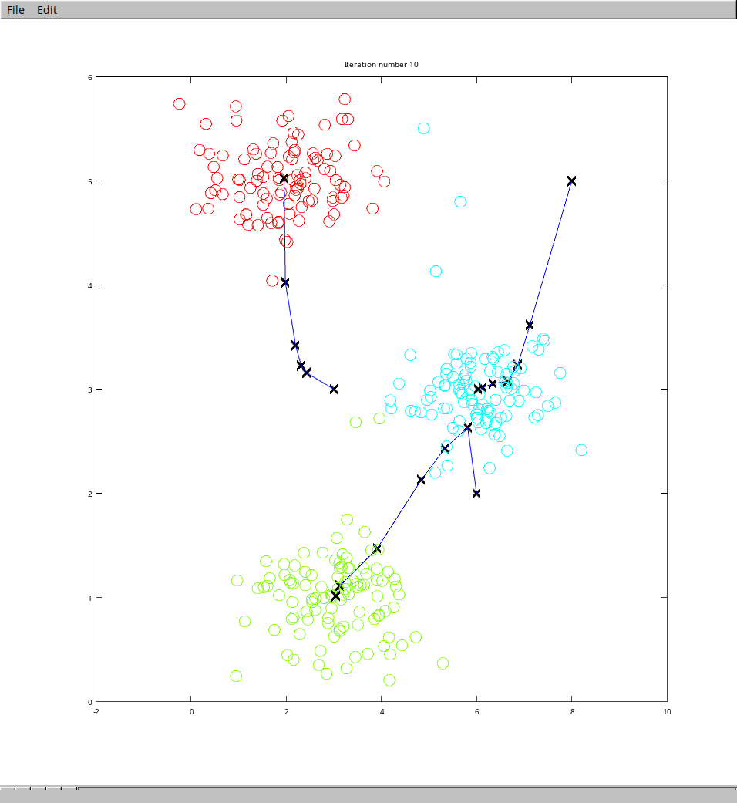
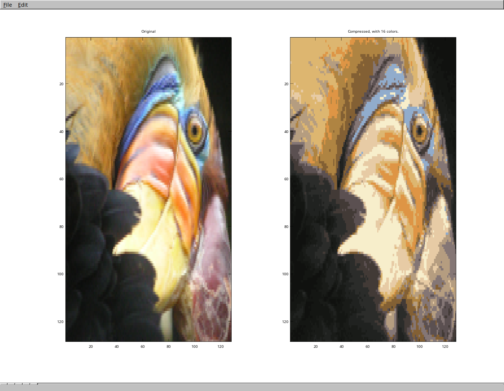

# K-means

## Algorithm

Link to Andrew Ng's course about K-means algorithm :

- [Week 8 : Unsupervised Learning](https://www.coursera.org/learn/machine-learning/home/week/8)

## How to run the code ?

I use [Octave](https://gnu.org/software/octave/) to run the code :

```bash
$ octave-cli

[...]

octave:1> k_means

Loading data...
Pause. Press ENTER to continue...

Running K-means algorithm...

Iteration 1/10...
Press ENTER to continue...
Iteration 2/10...
Press ENTER to continue...
Iteration 3/10...
Press ENTER to continue...
Iteration 4/10...
Press ENTER to continue...
Iteration 5/10...
Press ENTER to continue...
Iteration 6/10...
Press ENTER to continue...
Iteration 7/10...
Press ENTER to continue...
Iteration 8/10...
Press ENTER to continue...
Iteration 9/10...
Press ENTER to continue...
Iteration 10/10...
Press ENTER to continue...
```

You should get an output that seems like this :



You might have different cendroids' progressions because the initials ones are choose randomly, but you should get the 3 different clusters approximately right.

## Data used

The previous data (`data.mat`) is from Andrew Ng's course and represent an example of a 2D dataset. We can also use this code (with a little bit of modification), to compress images, like so :



The original image is also from Andrew Ng's course.
