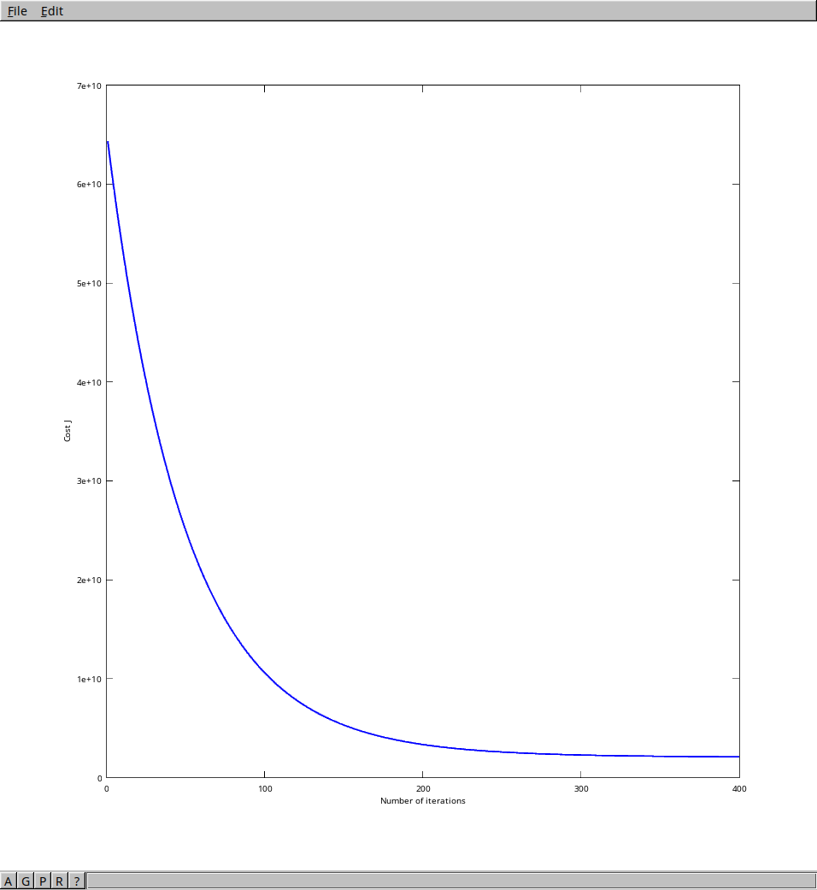

# Linear Regression

## Algorithm

Links to Andrew Ng's courses about linear regression :

- [Week 1 : Introduction](https://www.coursera.org/learn/machine-learning/home/week/1)
- [Week 2 : Linear regression with multiple variables](https://www.coursera.org/learn/machine-learning/home/week/2)

This implementation is using **gradient descent** algorithm to produce the hypothesis function and the cost function is the **squared error function**.

## How to run the code ?

I use [Octave](https://gnu.org/software/octave/) to run the code :

```bash
$ octave-cli

[...]

octave:1> linear_regression
Loading data...
Loaded 2 features with 47 examples.
Loaded 47 output examples.
Pause. Press ENTER to continue...
Normalizing features...
Running gradient descent...
Theta values :
        334302.063993
        100087.116006
        3673.548451
octave:2> 
```

And this is the plot used to check our gradient descent efficiency :



## Data used

The file `data.txt` is from Andrew Ng's course and is supposed to represent prices of different houses. The first column is the size of the house (in square feet), the second column is the number of bedrooms, and the third column is the price.
