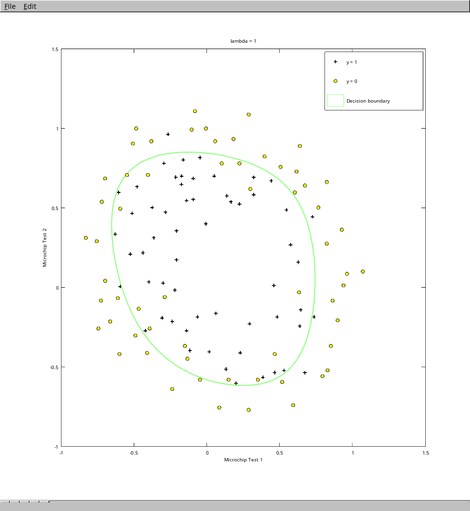

# Logistic Regression

## Algorithm

Links to Andrew Ng's course about logistic regression :

- [Week 3 : Logistic Regression](https://www.coursera.org/learn/machine-learning/home/week/3)

This implementation is using **optimized built-in function** to produce the hypothesis function and **regularization** technique to prevent overfitting.

## How to run the code ?

I use [Octave](https://gnu.org/software/octave/) to run the code :

```bash
$ octave-cli

[...]

octave:1> logistic_regressionA
Loading data...
Loaded 2 features with 118 examples.
Loaded 118 output examples.
Pause. Press ENTER to continue...
Adding features...
Optimizing thetas...
Training accuracy : 83.050847
```

And this is the plot showing the decision boundary :



## Data used

The file `data.txt` is from Andrew Ng's course and is supposed to represent multiple tests endured by microchips to determine if they are good enough to be sold. The first two columns represent the output of the two tests, and the last one is set to 1 if we can sell it and 0 otherwise.
