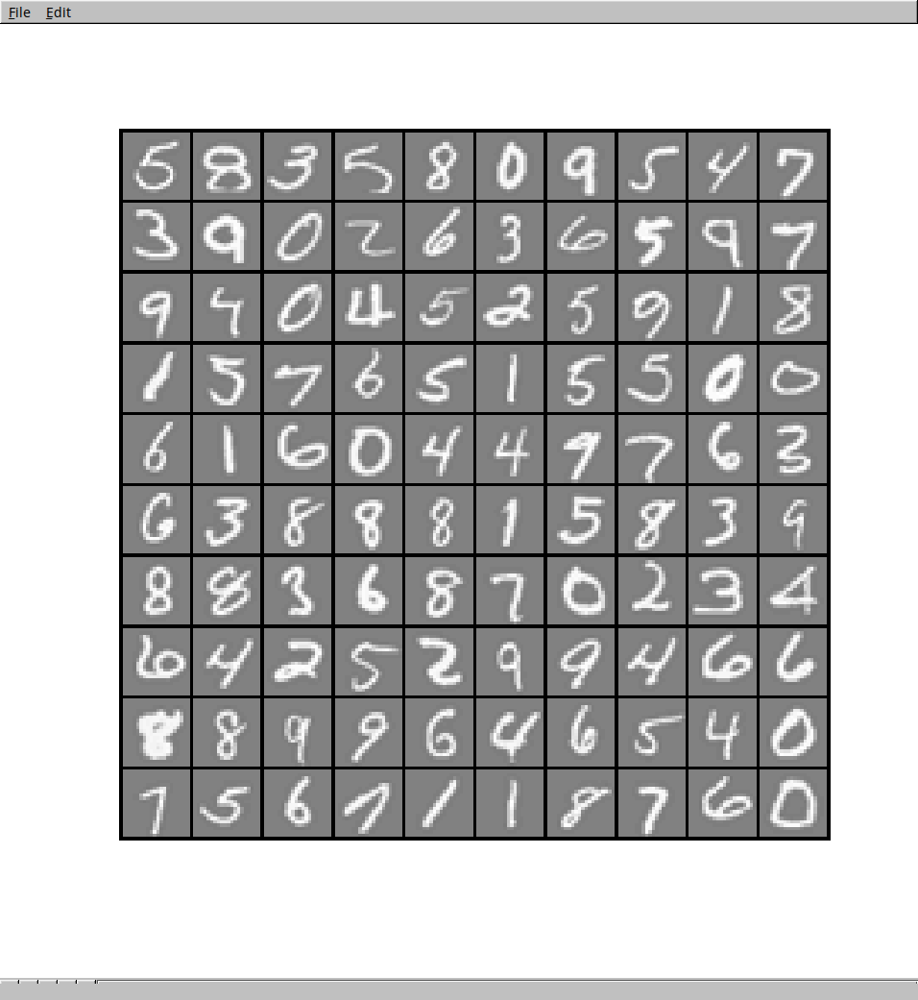

# Neural Network

## Algorithm

Links to Andrew Ng's courses about neural networks :

- [Week 4 : Neural Networks: Representation](https://www.coursera.org/learn/machine-learning/home/week/4)
- [Week 5 : Neural Networks: Learning](https://www.coursera.org/learn/machine-learning/home/week/5)

This implementation is using **forward/backward propagation** with **regularization**.

## How to run the code ?

I use [Octave](https://gnu.org/software/octave/) to run the code :

```bash
$ octave-cli

[...]

octave:1> neural_network
Loading data...
Pause. Press ENTER to continue...
Training neural network...
Iteration    50 | Cost: 4.523347e-01
Training accuracy : 95.840000
```

You should get a training accuracy around 95%.

## Data used

The file `data.mat` is from Andrew Ng's course and represent a training set of hand-written digits. This will be used to train the neural network and help it recognize by itself hand-written digits.

Here are some digits taken from the dataset as examples :


