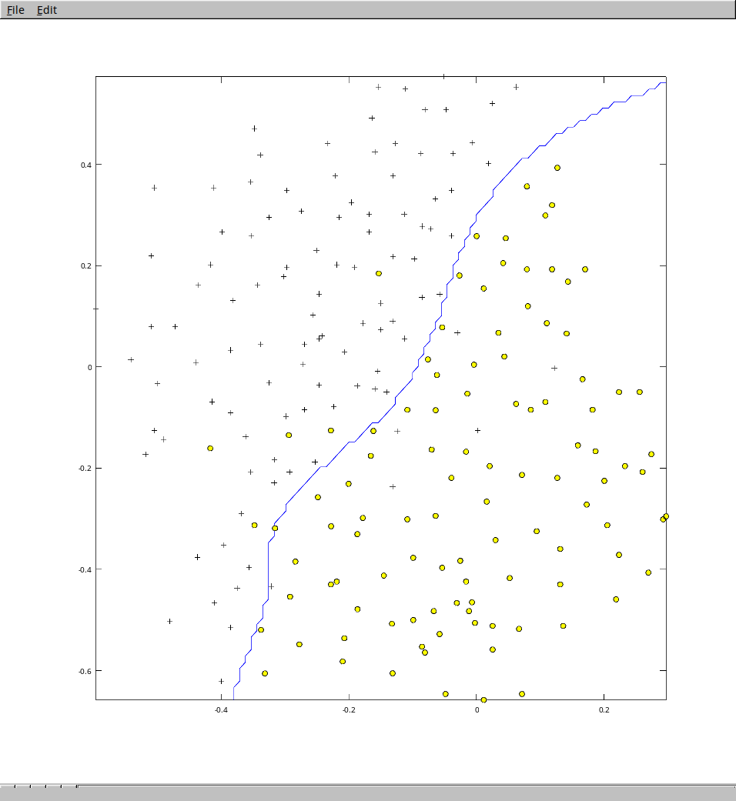
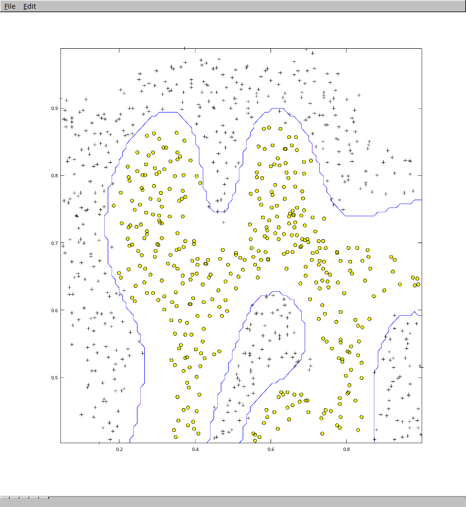

# Support Vector Machines

## Algorithm

Link to Andrew Ng's course about svm :

- [Week 7 : Support Vector Machines](https://www.coursera.org/learn/machine-learning/home/week/7)

This implementation is using the **gaussian kernel**.

## How to run the code ?

I use [Octave](https://gnu.org/software/octave/) to run the code :

```bash
$ octave-cli

[...]

octave:1> svm
Loading data...
Pause. Press ENTER to continue...
Selecting best SVM parameters...

[...]

C = 0.300000
sigma = 0.100000
Training SVM (with gaussian kernel)...

[...]
```

And this is the plot showing the decision boundary :



Here is another example of a more complex non-linear decision boundary :



## Data used 

The file `data.mat` is from Andrew Ng's course and is just an example of a 2D dataset.
